# 数学

## 数论

### 快(龟?)速幂

#### 整数快速幂

```c++
ll ksm(ll a, ll b , ll m)//a的b次方对m取模
{
	ll ans = 1;
	for (; b; b >>= 1, a = a * a % m)
		if (b & 1)ans = ans * a % m;
	return ans;
}
```

int128版本(牛牛牛)

```c++
inline ll ksm(__int128 a, ll b, ll m)//a的b次方对m取模
{
	__int128 ans = 1;
	for (; b; b >>= 1, a = a * a % m)
		if (b & 1)ans = ans * a % m;
	return ans;
}
```


#### 矩阵快速幂

```c++
vector<vector<ll>> matric_imul(vector<vector<ll>>a, vector<vector<ll>>b, ll n,ll m,ll t)
{
	vector<vector<ll>>ret(n, vector<ll>(t));
	for (ll i = 0; i < n; i++)
		for (ll j = 0; j < t; j++)
			for (ll k = 0; k < m; k++)
				ret[i][j] = (ret[i][j] + a[i][k] * b[k][j]) % MOD;
	return ret;
}

vector<vector<ll>> matric_ksm(vector<vector<ll>>& a, ll b, ll n)
{
	vector<vector<ll>>ret(n, vector<ll>(n));
	for (int i = 0; i < n; i++)
		ret[i][i] = 1;
	for (; b; b >>= 1, a = matric_imul(a, a, n,n,n))
		if (b & 1) ret = matric_imul(a, ret, n,n,n);
	return ret;
}
```


#### 龟速乘&龟速幂

防爆ll(直接用int128好了，没啥用别看)

```c++
ll gsc(ll a, ll b, ll p)
{
	ll res = 0;
	while (b)
	{
		if (b & 1) res = (res + a) % p;
		a = (a << 1) % p;
		b >>= 1;
	}
	return res;
}
```

```c++
ll gsm(ll a, ll b , ll m)//a的b次方对m取模
{
	ll ans = 1;
	for (; b; b >>= 1, a = gsc(a,a,m))
		if (b & 1)ans = gsc(ans,a,m);
	return ans;
}
```


### 欧几里得

#### 求gcd

辗转相除

```c++
ll my_gcd(ll a, ll b)
{
	while (b != 0)
	{
		ll tmp = a;
		a = b;
		b = tmp % b;
	}
	return a;
}
```

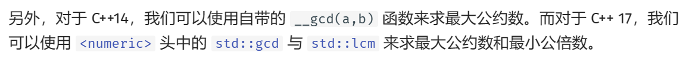

lcm=乘积/gcd

#### 拓展欧几里得

常用于解方程：
$$
ax+by=gcd(a,b)
$$

```c++
ll ex_gcd(ll a, ll b, ll& x, ll& y)//返回值为gcd(a,b)
{
	if (!b)
	{
		x = 1;
		y = 0;
		return a;
	}
	ll d = ex_gcd(b, a % b, x, y);
	ll t = x;
	x = y;
	y = t - (a / b) * y;
	return d;
}

```

### 求质因数

#### 简单求法

```c++
int sys[MAXN + 5];//素因数
int sys_idx = 0;

inline void sys_init(int n)//初始化素因数
{
	sys_idx = 0;
	for (int i = 2; i * i <= n; i++)
	{
		if (n % i == 0)
		{
			sys[++sys_idx] = i;
			while (n % i == 0)
				n /= i;
		}
	}
	if (n > 1) 
		sys[++sys_idx] = n;
}
```

#### Pollard rho(待补充)


### 求逆元

#### 费马小定理&欧拉定理

欧拉定理需要保证a,n互质

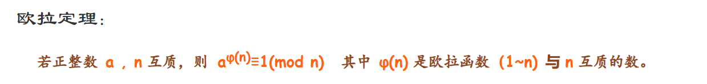


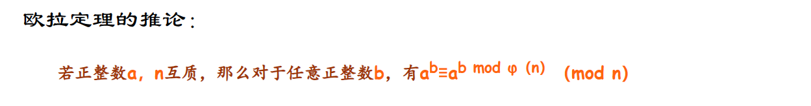

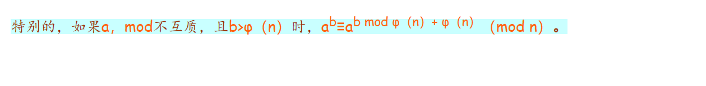

```c++
ll qny(ll a, ll m)//求a在mod m下的乘法逆元
{
	return ksm(a, m - 2, m);
}
```

#### 拓展o吉利的

```c++
void ex_gcd(ll a, ll b, ll& x, ll& y)
{//求逆元的话这样写: Exgcd(a,p,x,y);//x为结果，求1/a≡x(mod p)
	if (!b) x = 1, y = 0;
	else ex_gcd(b, a % b, y, x), y -= a / b * x;
}
```

#### 线性求一串

```c++
int ny[3000005];//线性求逆元（求1~n的逆元）
ny[1] = 1;
for (int i = 2; i <= n; i++)
	ny[i] = (p - p / i) * ny[p % i] % p;
```


### 中国剩余定理

#### crt

求一系列同余方程的最小解，满足m互质

```c++
ll crt(ll a[], ll b[], int n)//a[]为除数，b[]为余数
{
	ll lc = 1,x=0;//连乘
	for (int i = 0; i < n; ++i) //算出它们累乘的结果
		lc *= a[i];
	for (int i = 0; i < n; ++i)
	{
		x = (x + (__int128) b[i] * (lc / a[i]) * qny(lc / a[i], a[i])) %lc;//int128快速幂
	}
	return x;
}
```


#### ex_crt

同上，但m不互质（）

```c++
ll ex_crt(ll *cs,ll *ys,ll n)
{
	ll x, y;
	ll M = cs[0], ans = ys[0];
	for (int i = 1; i < n; i++)
	{
		ll a = M, b = cs[i], c = (ys[i] - ans % b + b) % b;
		ll gcd = ex_gcd(a, b, x, y), bg = b / gcd;
		if (c % gcd != 0)
			return -1;
		x = gsc(x, c / gcd, bg);//需要用龟速乘或者int128下的快速幂
		//不会爆的时候x = (x * c / gcd % bg + bg) % bg;
		ans += x * M;
		M *= bg;
		ans = (ans % M + M) % M;
	}
	return (ans % M + M) % M;
}

```


### 数论分块

#### 整除分块

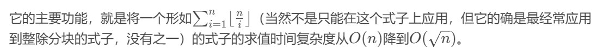

```c++
ll fenkuai(ll n)
{
	ll res = 0;
	for (ll l = 1, r; l <= n; l = r + 1)
	{
		r = n / (n / l);
		res += n / l * (r - l + 1);
	}
	return res;
}
```


### 线性筛

```c++
bool Mark[N];
int prime[N];
void init()
{
	ll index = 0;
	for (ll i = 2; i <= N; i++)
	{
		if (!Mark[i])
		{
			prime[++index] = i;
		}
		for (ll j = 1; j <= index && prime[j] * i <= N; j++)
		{
			Mark[i * prime[j]] = true;
			if (i % prime[j] == 0)
			{
				break;
			}
		}
	}
	return;
}

```


### 欧拉函数

#### 求单个点 O(sqrt(n))

```c++
int ksm(int a, int b)
{
	int ans = 1;
	for (; b; b >>= 1, a = a * a)
		if (b & 1) ans = ans * a;
	return ans;
}

int Get(int n)//求单个数欧拉函数
{
	int ans = 1;
	for (int i = 2; i * i <= n; ++i)
	{
		int cnt = 0;
		while (n % i == 0) {n /= i; ++cnt;}
		if (cnt != 0) ans = ans * ksm(i, cnt - 1) * (i - 1);//基本性质 4
	}
	if (n != 1) ans = ans * (n - 1);//n^0=1
	return ans;
}

```


#### 求一串 O(n)

使用线性筛：

```c++
bool Mark[N];//线性筛用的标记
int prime[N];//素数
ll phi[N];//欧拉函数值
void init()
{
	ll idx = 0;
	phi[1] = 1;
	for (ll i = 2; i <= N; i++)
	{
		if (!Mark[i])
		{
			prime[++index] = i;
			phi[i] = i - 1;
		}
		for (ll j = 1; j <= idx && prime[j] * i <= N; j++)
		{
			Mark[i * prime[j]] = true;
			if (i % prime[j] == 0)
			{
				phi[i * prime[j]] = prime[j] * phi[i];
				break;
			}
			phi[i * prime[j]] = phi[i] * (prime[j] - 1);
		}
	}
	return;
}
```


### 莫比乌斯函数

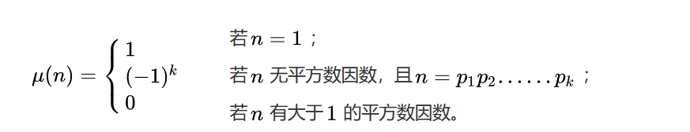

#### 求一串法：线性筛

```c++
bool Mark[N];
int prime[N];
int miu[N];//莫比乌斯函数值
void init()
{
	ll index = 0;
	miu[1] = 1;
	for (ll i = 2; i <= N; i++)
	{
		if (!Mark[i])
		{
		prime[++index] = i;
		miu[i] = -1;
		}
		for (ll j = 1; j <= index && prime[j] * i <= N; j++)
		{
			Mark[i * prime[j]] = true;
			if (i % prime[j] == 0)
			{
				miu[i * prime[j]] = 0;
				break;
			}
			miu[i * prime[j]] = -miu[i];
		}
	}
	return;
}
```


### 杜教筛

解释：在非线性时间内求出积性函数的前缀和

预处理出前n<sup>2/3</sup>的积性函数的前缀和，是最快的

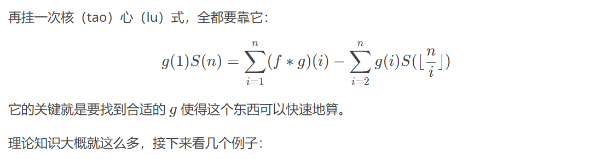

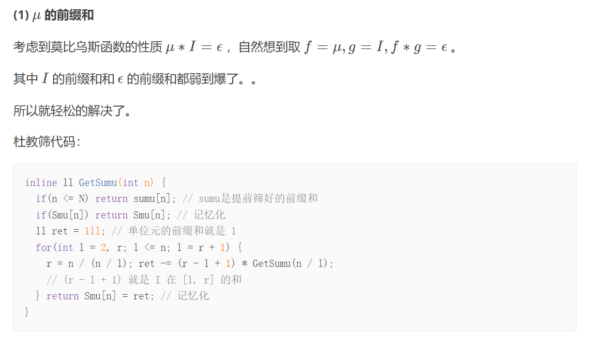

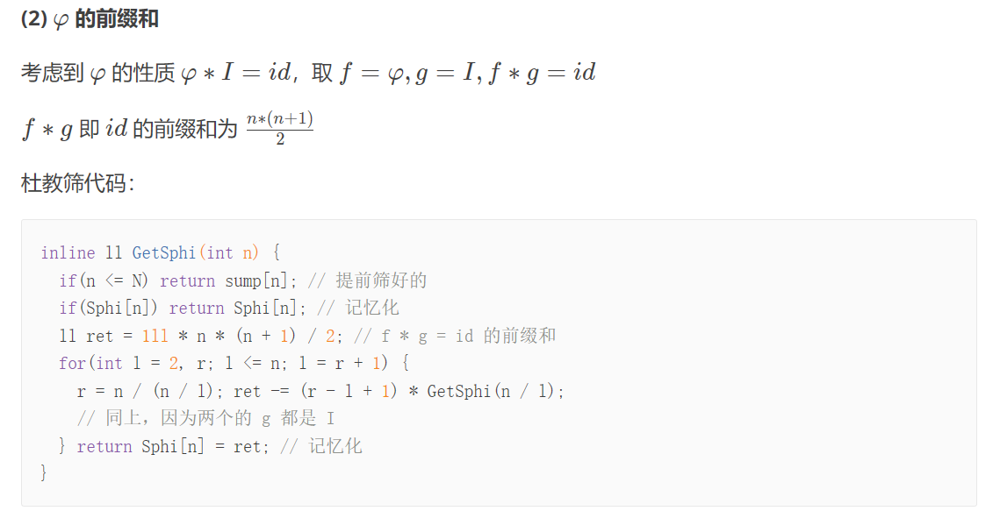

例题：[P4213](https://www.luogu.com.cn/problem/P4213)[ ](https://www.luogu.com.cn/problem/P4213)[【模板】杜教筛（](https://www.luogu.com.cn/problem/P4213)[Sum](https://www.luogu.com.cn/problem/P4213)[）](https://www.luogu.com.cn/problem/P4213)[ ](https://www.luogu.com.cn/problem/P4213)[-](https://www.luogu.com.cn/problem/P4213)[ ](https://www.luogu.com.cn/problem/P4213)[洛谷](https://www.luogu.com.cn/problem/P4213)[ ](https://www.luogu.com.cn/problem/P4213)[|](https://www.luogu.com.cn/problem/P4213)[ ](https://www.luogu.com.cn/problem/P4213)[计算机科学教育新生态](https://www.luogu.com.cn/problem/P4213)[ ](https://www.luogu.com.cn/problem/P4213)[(luogu.com.cn)](https://www.luogu.com.cn/problem/P4213)

```c++
#include<bits/stdc++.h>
using namespace std;
//==================================================================================//define宏定义区
#define ll long long
#define db double
#define pll pair<long long,long long>
#define PI acos(-1.0)
#define mod 1000000007
#define N 5000005
#define M 1000005
//==================================================================================//全局变量区
bool Mark[N];
int prime[N];
ll phi[N];
int miu[N];
unordered_map<int, int>ans_miu;
unordered_map<int, ll>ans_phi;
//==================================================================================//函数区
void init()
{
    ll index = 0;
    phi[1] = 1;
    miu[1] = 1;
    for (ll i = 2; i <= N; i++)
    { 
        if (!Mark[i])
        {
            prime[++index] = i;
            phi[i] = i - 1;
            miu[i] = -1;
        }
        for (ll j = 1; j <= index && prime[j] * i <= N; j++)
        {
            Mark[i * prime[j]] = true;
            if (i % prime[j] == 0)
            {
                phi[i * prime[j]] = prime[j] * phi[i];
                miu[i * prime[j]] = 0;
                break;
            }
            phi[i * prime[j]] = phi[i] * (prime[j] - 1);
            miu[i * prime[j]] = -miu[i];
        }
    }
    for (ll i = 1; i <= N; i++)//求N内的前缀和
    {
        miu[i] += miu[i - 1];
        phi[i] += phi[i - 1];
    }
    return;
}
ll get_phi(ll x)
{
    if (x <= N) return phi[x];
    if (ans_phi[x]) return ans_phi[x];
    ll ans = ((1ll + x) * x) / 2ll;
    for (ll l = 2, r; l <= x; l = r + 1)//其实这里可能会爆int，可以改用用unsigned int
    {
        r = x / (x / l);
        ans -= 1ll * (r - l + 1) * get_phi(x / l);
    }
    return ans_phi[x] = ans;
}
int get_miu(int x)
{
    if (x <= N) return miu[x];
    if (ans_miu[x]) return ans_miu[x];
    int ans = 1;
    for (ll l = 2, r; l <= x; l = r + 1)
    {
        r = x / (x / l);
        ans -= (r - l + 1) * get_miu(x / l);
    }
    return ans_miu[x] = ans;
}

void solve()
{
    ll x;
    scanf("%lld", &x);
    printf("%lld %d\n", get_phi(x), get_miu(x));
}
//==================================================================================//
int main()
{
    //std::ios::sync_with_stdio(false);
    std::cin.tie(0);
    std::cout.tie(0);
    ll t = 1;
    scanf("%lld", &t);
    //cin>>t;
    init();
 while (t--)
        solve();
    return 0;
}
```

### MR大素数判定

```c++
bool MR(ll x)
{
    if (x < 3)
        return x == 2;
    if (x % 2 == 0)
        return false;
    ll A[] = {2, 325, 9375, 28178, 450775, 9780504, 1795265022}, d = x - 1, r = 0;
    while (d % 2 == 0) 
        d /= 2, ++r;
    for (auto a : A)
    {
        ll v = ksm(a, d, x); //要用int128版的快速幂
        if (v <= 1 || v == x - 1)
            continue;
        for (int i = 0; i < r; ++i)
        {
            v = (__int128)v * v % x; 
            if (v == x - 1 && i != r - 1) 
            {
                v = 1;
                break;
            }
            
            if (v == 1)
                return false;
        }
        if (v != 1)
            return false;
    }
    return true;
}
```

py版：

```python
def ksm(a: int, b: int, m: int):
    ans = 1
    while b != 0:
        if b & 1:
            ans = ans * a % m
        b >>= 1
        a = a * a % m
    return ans


def MR(x: int):
    if x < 3:
        return x == 2
    if x % 2 == 0:
        return False
    A = [2, 325, 9375, 28178, 450775, 9780504, 1795265022]
    d = x - 1
    r = 0
    while d % 2 == 0:
        d //= 2
        r += 1
    for a in A:
        v = ksm(a, d, x)
        if v <= 1 or v == x - 1:
            continue
        for i in range(0, r):
            v = v * v % x
            if v == x - 1 and i != r - 1:
                v = 1
                break
            if v == 1:
                return False
        if v != 1:
            return False
    return True
```


### ex_BSGS


```c++
ll BSGS(ll y, ll z, ll p, ll ad)
{
	ll m = ceil(sqrt(p));
	unordered_map<ll, ll>mp;
	ll tmp = z;
	for (ll b = 0; b < m; b++, tmp = tmp * y % p)
		mp[tmp] = b;
	ll y_m = ksm(y, m, p);
	for (ll a = 0, tmp = ad; a <= m + 1; a++, tmp = tmp * y_m % p)
	{
		if (mp.find(tmp) != mp.end())
			if (a * m - mp[tmp] >= 0)return a * m - mp[tmp];
	}
	return -1;
}

ll ex_BSGS(ll a, ll n, ll p)//可以处理gcd(a,p)!=1的情况
{
	a %= p;
	n %= p;
	if (n == 1 || p == 1)return 0;
	int cnt = 0;
	int d = my_gcd(a, p), ad = 1;
	while (d != 1)
	{
		if (n % d)return -1;
		cnt++;
		n /= d;
		p /= d;
		ad = ad * a / d % p;
		if (ad == n)return cnt;
		d = my_gcd(a, p);
	}
	ll ans = BSGS(a, n, p, ad);
	if (ans == -1)return -1;
	return ans + cnt;
}
```

### 二次剩余（Cipolla）

复杂度$O(log p)$

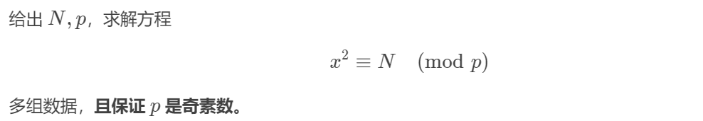

```c++
ll MOD = 7;
ll I2;

struct cp
{
	ll x, y;
	inline cp(ll _x, ll _y) :x(_x), y(_y) {};
};
inline cp operator *(cp a, cp b) {
	return cp((a.x * b.x + I2 * a.y % MOD * b.y) % MOD, (a.x * b.y + a.y * b.x) % MOD);
}
inline bool operator ==(cp a, cp b) {
	return a.x == b.x && a.y == b.y;
}

ll cp_ksm(cp a, ll b)
{
	cp res(1, 0);
	for (; b; b >>= 1, a = a * a)if (b & 1)res = res * a;
	return res.x;
}

ll cp_sqrt(ll x)
{
	if (!x)return 0;
	if (ksm(x, (MOD - 1) >> 1, MOD) == MOD - 1) return -1;
	ll a;
	while (1)
	{
		a = rand() % MOD;
		I2 = ((a * a % MOD - x) % MOD + MOD) % MOD;
		if (ksm(I2, (MOD - 1) >> 1, MOD) == MOD - 1)
			return cp_ksm(cp(a, 1), (MOD + 1) >> 1);
	}
}

void solve()
{
	ll n;
	cin >> n >> MOD;
	ll ans1 = cp_sqrt(n % MOD);
	if (ans1 == -1)
		printf("Hola!\n");
	else if (ans1 == 0)
		printf("0\n");
	else
	{
		ll ans2 = MOD - ans1;
		printf("%lld %lld\n", min(ans1, ans2), max(ans1, ans2));
	}
}
```


### 原根


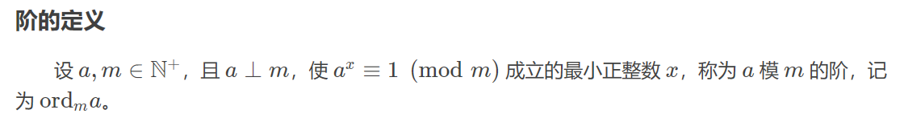

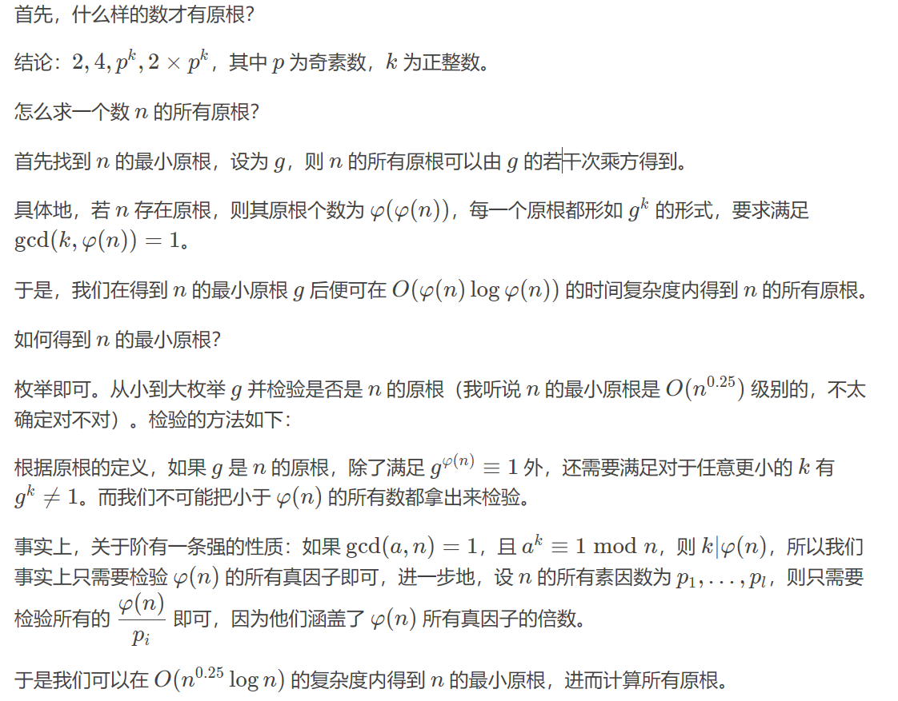


```c++
bool Mark[MAXN+5];//线性筛用的标记
int prime[MAXN+5];//素数
ll phi[MAXN+5];//欧拉函数值

bool rt_yes[MAXN + 5];//是否有原根
int rt[MAXN + 5];
int rt_idx=0;

int sys[MAXN + 5];//素因数
int sys_idx = 0;

inline void sys_init(int n)//初始化素因数
{
	sys_idx = 0;
	for (int i = 2; i * i <= n; i++)
	{
		if (n % i == 0)
		{
			sys[++sys_idx] = i;
			while (n % i == 0)
				n /= i;
		}
	}
	if (n > 1) 
		sys[++sys_idx] = n;
}

void init()//处理phi以及rt_yes
{
	ll idx = 0;
	phi[1] = 1;
	for (ll i = 2; i <= MAXN; i++)
	{
		if (!Mark[i])
		{
			prime[++idx] = i;
			phi[i] = i - 1;
		}
		for (ll j = 1; j <= idx && prime[j] * i <= MAXN; j++)
		{
			Mark[i * prime[j]] = true;
			if (i % prime[j] == 0)
			{
				phi[i * prime[j]] = prime[j] * phi[i];
				break;
			}
			phi[i * prime[j]] = phi[i] * (prime[j] - 1);
		}
	}
	rt_yes[2] = rt_yes[4] = 1;
	for (int i = 2; i <= idx; i++)
	{
		for (ll j = prime[i]; j <= MAXN; j *= prime[i])
			rt_yes[j] = 1;
		for (ll j = 2 * prime[i]; j <= MAXN; j *= prime[i])
			rt_yes[j] = 1;
	}
	return;
}

bool check(int x, int p)//检查x是否为p的原根
{
	if (ksm(x, phi[p], p) != 1) 
		return 0;
	for (int i = 1; i <= sys_idx; i++) 
		if (ksm(x, phi[p] / sys[i], p) == 1) 
			return 0;
	return 1;
}

int find_rt_min(int p)//找到p的最小原根
{
	for (int i = 1; i < p; i++)
		if (check(i, p))
			return i;
	return -1;//error
}

void rt_get(int p, int rt_min)//根据p，p的最小原根，找到所有原根并存入rt数组
{
	rt_idx = 0;
	ll rt_try=1;
	for (int i = 1; i <= phi[p]; i++)
	{
		rt_try = rt_try * rt_min % p;
		if (gcd(i, phi[p]) == 1)
			rt[++rt_idx] = rt_try;
	}
}

inline void solve()//输出p的全部原根//main函数里先init()一下
{
	int p;
	cin >> p;
	if (rt_yes[p])
	{
		sys_init(phi[p]);
		int rt_min = find_rt_min(p);
		rt_get(p, rt_min);
		sort(rt + 1, rt + 1 + rt_idx);
		printf("%d\n", rt_idx);
		for (int i = 1; i <= rt_idx; i++)
			printf("%d ", rt[i]);
		printf("\n");
	}
	else
	{
		printf("0\n\n");
	}
}
```


### 类欧几里得

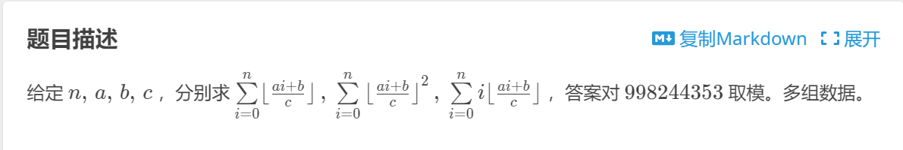

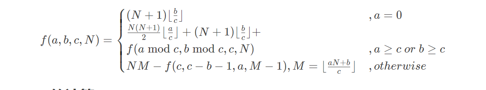

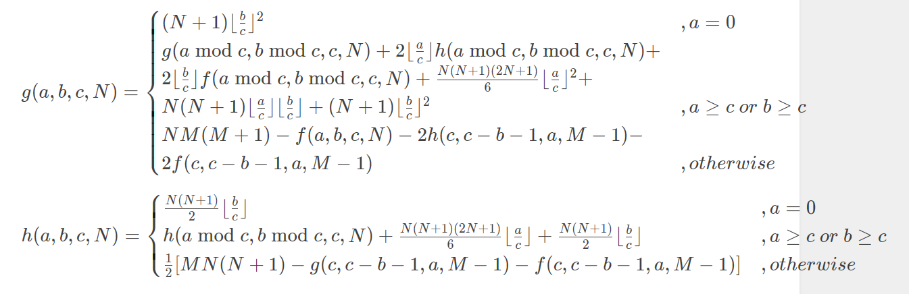

```c++
#include<bits/stdc++.h>
#define ll long long
using namespace std;
const ll P = 998244353;
ll i2 = 499122177, i6 = 166374059;

struct funs {
	funs() { f = g = h = 0; }
	ll f, g, h;
};

funs calc(ll n, ll a, ll b, ll c) {
	ll ac = a / c, bc = b / c, m = (a * n + b) / c, n1 = n + 1, n21 = n * 2 + 1;
	funs d;
	if (a == 0) {
		d.f = bc * n1 % P;
		d.g = bc * n % P * n1 % P * i2 % P;
		d.h = bc * bc % P * n1 % P;
		return d;
	}if (a >= c || b >= c) {
		d.f = n * n1 % P * i2 % P * ac % P + bc * n1 % P;
		d.g = ac * n % P * n1 % P * n21 % P * i6 % P + bc * n % P * n1 % P * i2 % P;
		d.h = ac * ac % P * n % P * n1 % P * n21 % P * i6 % P + bc * bc % P * n1 % P + ac * bc % P * n % P * n1 % P;
		d.f %= P, d.g %= P, d.h %= P;
		funs e = calc(n, a % c, b % c, c);
		d.h += e.h + 2 * bc % P * e.f % P + 2 * ac % P * e.g % P;
		d.g += e.g, d.f += e.f;
		d.f %= P, d.g %= P, d.h %= P;
		return d;
	}funs e = calc(m - 1, c, c - b - 1, a);
	d.f = n * m % P - e.f, d.f = (d.f % P + P) % P;
	d.g = m * n % P * n1 % P - e.h - e.f, d.g = (d.g * i2 % P + P) % P;
	d.h = n * m % P * (m + 1) % P - 2 * e.g - 2 * e.f - d.f;
	d.h = (d.h % P + P) % P;
	return d;
}

ll T, n, a, b, c;
signed main() 
{
	scanf("%lld", &T);
	while (T--) {
		scanf("%lld%lld%lld%lld", &n, &a, &b, &c);
		funs ans = calc(n, a, b, c);
		printf("%lld %lld %lld\n", ans.f, ans.h, ans.g);
	}return 0;
}
```


## 组合数学

### O1组合数

用于MOD较大，

一般 0 <= n,m <= 1e6 , MOD=1e9+7

```c++
const ll MOD = 1000000007;
const ll MAXN = (ll)1e5;
ll jc[MAXN+3];
ll jcny[MAXN+3];
void Cinit()
{
	jc[0] = 1, jcny[0] = 1;
	for (int i = 1; i <= MAXN; i++)
		jc[i] = jc[i - 1] * i % MOD;
	jcny[MAXN] =qny(jc[MAXN], MOD);
	for (int i = MAXN - 1; i >= 1; i--)
		jcny[i] = jcny[i + 1] * (i + 1) % MOD;
}

ll C(ll m, ll n, ll p)//正常情况下m>=n
{
	return m < n ? 0 : jc[m] * jcny[n] % p * jcny[m - n] % p;
}
```


### Lucas 定理

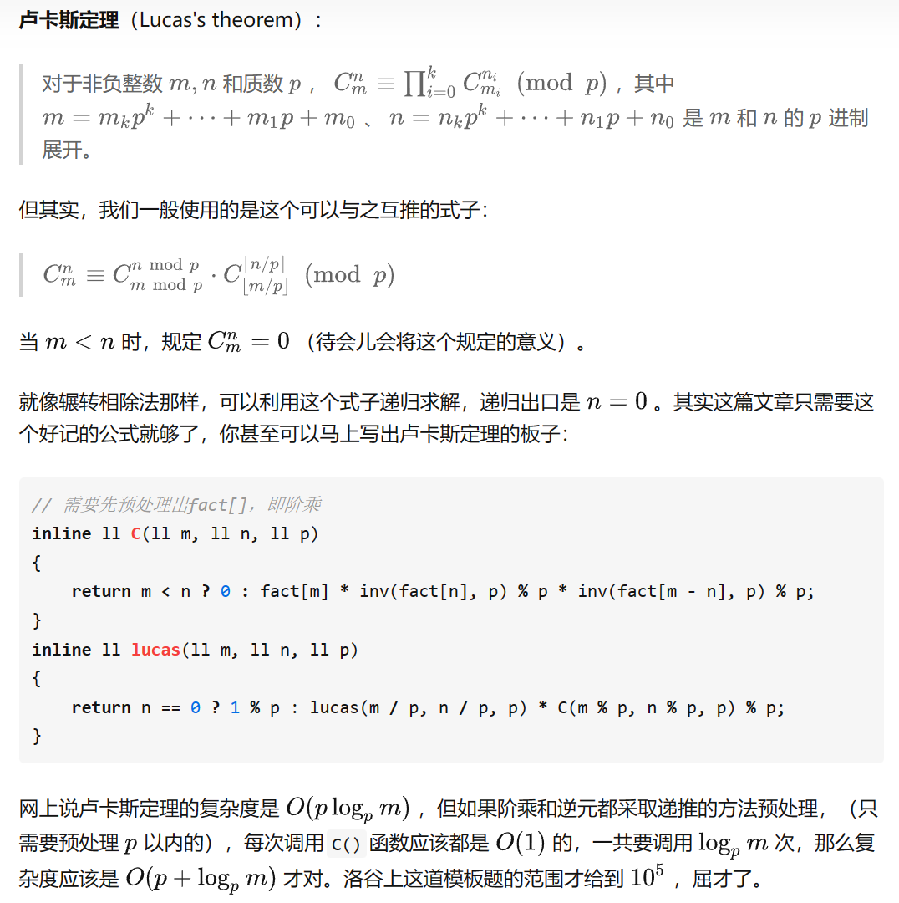

用于p<1e6 0<=n,m<=1e9

(需要O(p)预处理)

```c++
const ll MOD = 1000000007;
const ll MAXN = (ll)1e5;
ll jc[MAXN+3];
ll jcny[MAXN+3];
void Cinit(ll mod) //处理[1,mod-1]
{
	jc[0] = 1, jcny[0] = 1;
	for (int i = 1; i <= mod-1; i++)
		jc[i] = jc[i - 1] * i % mod;
	jcny[mod-1] =qny(jc[mod-1], mod);
	for (int i = mod-2; i >= 1; i--)
		jcny[i] = jcny[i + 1] * (i + 1) % mod;
}

ll C(ll m, ll n, ll p)//正常情况下m>=n
{
	return m < n ? 0 : jc[m] * jcny[n] % p * jcny[m - n] % p;
}

ll lucas(ll m, ll n, ll p)
{
	return n == 0 ? 1 : lucas(m / p, n / p, p) * C(m % p, n % p, p) % p;
}

```

### 第二类斯特林数

n个不同的物品 放进m个相同的箱子，每个箱子至少有一个物品 求方案数

递推版：

```c++
ll f(int n, int m)
{
	if (m <= 0 || n < m)
    	return 0;
    if (n == m)
    	return 1;
    else
    	return f(n-1, m-1) + f(n-1, m) * m;
}
```

打表：

第一类：

```c++
s[0][0]=1;
for(int i=1;i<=n;i++)
	for(int j=1;j<=i;j++)
		s[i][j]=s[i-1][j-1]+(i-1)*s[i-1][j];

```

第二类：

```c++
S[0][0]=1;
for(int i=1;i<=n;i++)
	for(int j=1;j<=i;j++)
		S[i][j]=S[i-1][j-1]+j*S[i-1][j];
```

```python
MAXN = 405
S = [[0] * MAXN for i in range(MAXN)] # 定义一个二维列表(二位数组)
for i in range(1, MAXN):
	S[i][i] = S[i][1] = 1
	for j in range(2, i):
		S[i][j] = S[i - 1][j - 1] + j * S[i - 1][j]
```


### 贝尔数

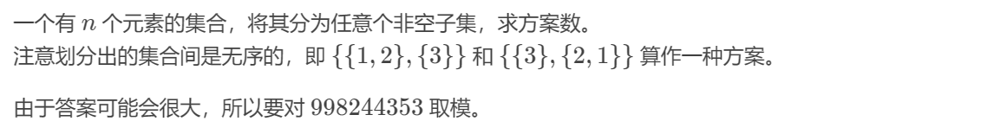

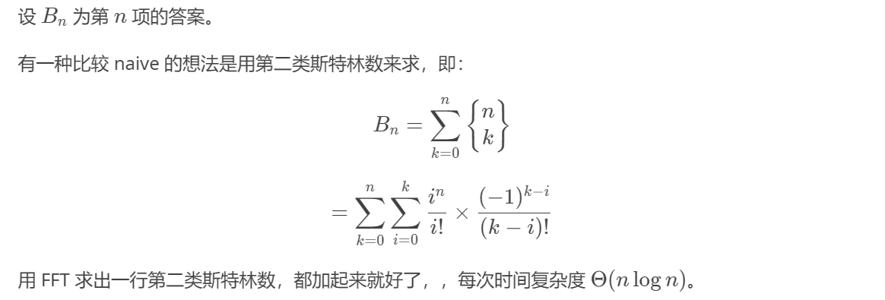

多项式：：

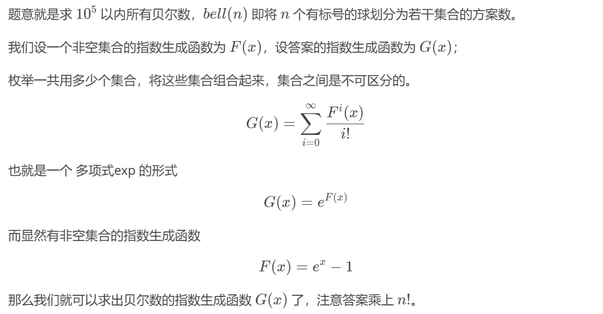

或贝尔三角形：：

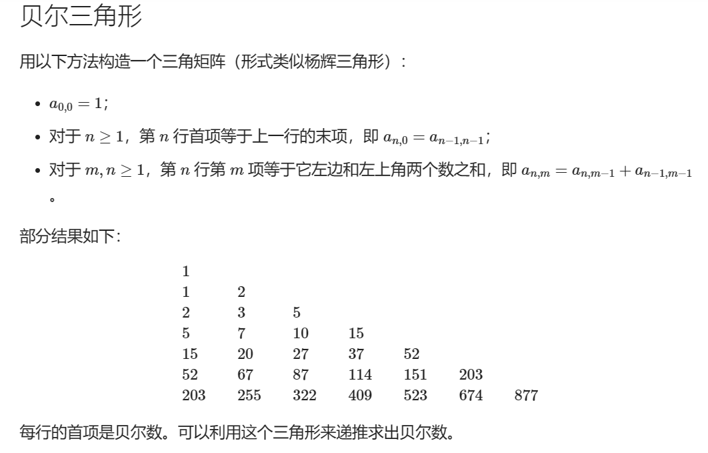

```c++
const int maxn = 2000 + 5;
int bell[maxn][maxn];

void f(int n) {
	bell[0][0] = 1;
  	for (int i = 1; i <= n; i++) 
    {
    	bell[i][0] = bell[i - 1][i - 1];
    	for (int j = 1; j <= i; j++)
      		bell[i][j] = bell[i - 1][j - 1] + bell[i][j - 1];
  	}
}
```


### 卡特兰数

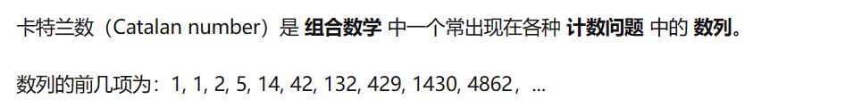


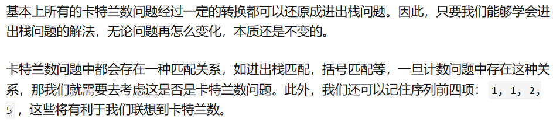

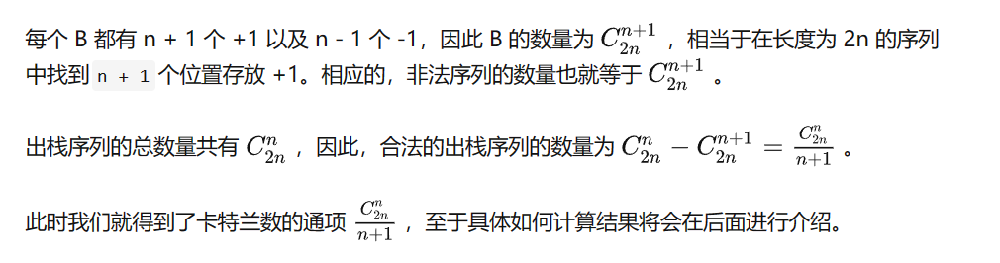


### 康托展开

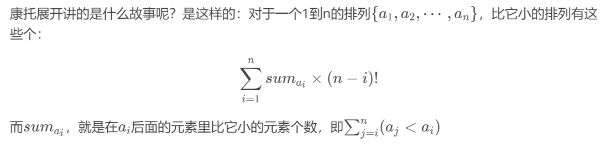

具体实现的时候求sum可以套一个树状数组

```c++
inline void solve()
{
	int n;
	cin >> n;//长度为n的排列
	jc[0] = 1;
	for (int i = 1; i <= n; i++)
	{
		jc[i] = jc[i - 1] * i % MOD;
		update(i, 1);
	}
    //预处理阶乘与树状数组(初始化为一)
	ll ans = 0;
	for (int i = 1; i <= n; i++)
	{
		cin >> v[i];
		ans = (ans + query(v[i] - 1) * jc[n - i] % MOD) % MOD;
		update(v[i], -1);//修改tree[v[i]] = 0;
	}
	printf("%lld\n", ans + 1);//此排列为第ans+1个
}
```


## 线性代数

### 线性基

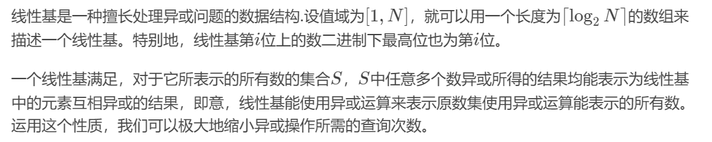

```c++
ll xxj[N + 5];
ll tmp[N + 5];
bool check0 = false;
int xxj_cnt = 0;//线性无关组的大小

void xxj_insert(ll x) {
	for (int i = N; i >= 0; i--)
		if (x & (1ll << i))
			if (!xxj[i]) { xxj[i] = x; return; }
			else x ^= xxj[i];
	check0 = true;
}

bool xxj_check(ll x) {
	for (int i = N; i >= 0; i--)
		if (x & (1ll << i))
			if (!xxj[i])return false;
			else x ^= xxj[i];
	return true;
}

ll xxj_max(ll res = 0) {
	for (int i = N; i >= 0; i--)
		res = max(res, res ^ xxj[i]);
	return res;
}

ll xxj_min() {
	if (check0)return 0;
	for (int i = 0; i <= N; i++)
		if (xxj[i])return xxj[i];
	return -1;
}

void xxj_wk()
{
	xxj_cnt = 0;
	for (int i = 0; i <= N; i++)
	{
		for (int j = i - 1; ~j; j--)
			if (xxj[i] & (1ll << j))xxj[i] ^= xxj[j];
		if (xxj[i])tmp[xxj_cnt++] = xxj[i];
	}
}

ll xxj_q(ll k) {//q之前work一下
	ll res = 0; 
	k -= check0; 
	if (!k)return 0;
	if (k >= (1ll << xxj_cnt))return -1;
	for (int i = 0; i < xxj_cnt; i++)
		if (k & (1ll << i))res ^= tmp[i];
	return res;
}
```

### 高斯消元法

#### 浮点数Gauss

```c++
db a[N][N];//增广矩阵
db x[N];//解集
bool freeX[N];//标记是否为自由变元

int Gauss(int equ, int var) {//返回自由变元个数
    /*初始化*/
    for (int i = 0; i <= var; i++) {
        x[i] = 0;
        freeX[i] = true;
    }

    /*转换为阶梯阵*/
    int col = 0;//当前处理的列
    int row;//当前处理的行
    for (row = 0; row < equ && col < var; row++, col++) {//枚举当前处理的行
        int maxRow = row;//当前列绝对值最大的行
        for (int i = row + 1; i < equ; i++) {//寻找当前列绝对值最大的行
            if (abs(a[i][col]) > abs(a[maxRow][col]))
                maxRow = i;
        }
        if (maxRow != row) {//与第row行交换
            for (int j = row; j < var + 1; j++)
                swap(a[row][j], a[maxRow][j]);
        }
        if (fabs(a[row][col]) < 1e-6) {//col列第row行以下全是0，处理当前行的下一列
            row--;
            continue;
        }

        for (int i = row + 1; i < equ; i++) {//枚举要删去的行
            if (fabs(a[i][col]) > 1e-6) {
                double temp = a[i][col] / a[row][col];
                for (int j = col; j < var + 1; j++)
                    a[i][j] -= a[row][j] * temp;
                a[i][col] = 0;
            }
        }
    }

    /*求解*/
    //无解
    for (int i = row; i < equ; i++)
        if (fabs(a[i][col]) > 1e-6)
            return -1;

    //无穷解: 在var*(var+1)的增广阵中出现(0,0,...,0)这样的行
    int temp = var - row;//自由变元有var-row个
    if (row < var)//返回自由变元数
        return temp;

    //唯一解: 在var*(var+1)的增广阵中形成严格的上三角阵
    for (int i = var - 1; i >= 0; i--) {//计算解集
        double temp = a[i][var];
        for (int j = i + 1; j < var; j++)
            temp -= a[i][j] * x[j];
        x[i] = temp / a[i][i];
    }
    return 0;
}

void solve()
{
    int n;
    cin >> n;
    for (int i = 0; i < n; i++)
        for (int j = 0; j <= n; j++)
            cin >> a[i][j];
    int free_num = Gauss(n, n);
    if (free_num != 0)
        printf("No Solution\n");
    else
    {
        for (int i = 0; i < n; i++)
            printf("%.2lf\n", x[i]);
    }
}
```


#### 模Gauss

注意输入参数的时候也要取模！！

```c++
const int MOD = 7;

int a[N][N];//增广矩阵
int x[N];//解集
bool freeX[N];//标记是否为自由变元

int GCD(int a, int b) {
	return !b ? a : GCD(b, a % b);
}
int LCM(int a, int b) {
	return a / GCD(a, b) * b;
}
int Gauss(int equ, int var) {//参数注意别传反了返回自由变元个数
	/*初始化*/
	for (int i = 0; i <= var; i++) {
		x[i] = 0;
		freeX[i] = true;
	}

	/*转换为阶梯阵*/
	int col = 0;//当前处理的列
	int row;//当前处理的行
	for (row = 0; row < equ && col < var; row++, col++) {//枚举当前处理的行
		int maxRow = row;//当前列绝对值最大的行
		for (int i = row + 1; i < equ; i++) {//寻找当前列绝对值最大的行
			if (abs(a[i][col]) > abs(a[maxRow][col]))
				maxRow = i;
		}
		if (maxRow != row) {//与第row行交换
			for (int j = row; j < var + 1; j++)
				swap(a[row][j], a[maxRow][j]);
		}
		if (a[row][col] == 0) {//col列第row行以下全是0，处理当前行的下一列
			row--;
			continue;
		}

		for (int i = row + 1; i < equ; i++) {//枚举要删去的行
			if (a[i][col] != 0) {
				int lcm = LCM(abs(a[i][col]), abs(a[row][col]));
				int ta = lcm / abs(a[i][col]);
				int tb = lcm / abs(a[row][col]);
				if (a[i][col] * a[row][col] < 0)//异号情况相加
					tb = -tb;
				for (int j = col; j < var + 1; j++) {
					a[i][j] = ((a[i][j] * ta - a[row][j] * tb) % MOD + MOD) % MOD;
				}
			}
		}
	}

	/*求解*/
	//无解：化简的增广阵中存在(0,0,...,a)这样的行，且a!=0
	for (int i = row; i < equ; i++)
		if (a[i][col] != 0)
			return -1;

	//无穷解: 在var*(var+1)的增广阵中出现(0,0,...,0)这样的行
	int temp = var - row;//自由变元有var-row个
	if (row < var)//返回自由变元数
		return temp;

	//唯一解: 在var*(var+1)的增广阵中形成严格的上三角阵
	for (int i = var - 1; i >= 0; i--) {//计算解集
		int temp = a[i][var];
		for (int j = i + 1; j < var; j++) {
			if (a[i][j] != 0)
				temp -= a[i][j] * x[j];
			temp = (temp % MOD + MOD) % MOD;//取模
		}
		while (temp % a[i][i] != 0)//外层每次循环都是求a[i][i]，它是每个方程中唯一一个未知的变量
			temp += MOD;//a[i][i]必须为整数，加上周期MOD
		x[i] = (temp / a[i][i]) % MOD;//取模
	}
	return 0;
}
```


#### 异或Gauss

```c++
int a[N][N];//增广矩阵
int x[N];//解集
int freeX[N];//自由变元
int Gauss(int equ,int var){//返回自由变元个数
    /*初始化*/
    for(int i=0;i<=var;i++){
        x[i]=0;
        freeX[i]=0;
    }
 
    /*转换为阶梯阵*/
    int col=0;//当前处理的列
    int num=0;//自由变元的序号
    int row;//当前处理的行
    for(row=0;row<equ&&col<var;row++,col++){//枚举当前处理的行
        int maxRow=row;//当前列绝对值最大的行
        for(int i=row+1;i<equ;i++){//寻找当前列绝对值最大的行
            if(abs(a[i][col])>abs(a[maxRow][col]))
                maxRow=i;
        }
        if(maxRow!=row){//与第row行交换
            for(int j=row;j<var+1;j++)
                swap(a[row][j],a[maxRow][j]);
        }
        if(a[row][col]==0){//col列第row行以下全是0，处理当前行的下一列
            freeX[num++]=col;//记录自由变元
            row--;
            continue;
        }
 
        for(int i=row+1;i<equ;i++){
            if(a[i][col]!=0){
                for(int j=col;j<var+1;j++){//对于下面出现该列中有1的行，需要把1消掉
                    a[i][j]^=a[row][j];
                }
            }
        }
    }
 
    /*求解*/
    //无解：化简的增广阵中存在(0,0,...,a)这样的行，且a!=0
    for(int i=row;i<equ;i++)
        if(a[i][col]!=0)
            return -1;
 
    //无穷解: 在var*(var+1)的增广阵中出现(0,0,...,0)这样的行
    int temp=var-row;//自由变元有var-row个
    if(row<var)//返回自由变元数
        return temp;
 
    //唯一解: 在var*(var+1)的增广阵中形成严格的上三角阵
    for(int i=var-1;i>=0;i--){//计算解集
        x[i]=a[i][var];
        for(int j=i+1;j<var;j++)
            x[i]^=(a[i][j]&&x[j]);
    }
    return 0;
}


int enumFreeX(int freeNum,int var){//枚举自由元，统计有解情况下1最少的个数
    int sta=(1<<(freeNum));//自由元的状态总数
    int res=INF;
    for(int i=0;i<sta;++i){//枚举状态
        int cnt=0;
        for(int j=0;j<freeNum;j++){//枚举自由元
            if(i&(1<<j)){
                cnt++;
                x[freeX[j]]=1;
            }else
                x[freeX[j]]=0;
        }
        for(int k=var-freeNum-1;k>=0;k--){//没有自由元的最下面一行
            int index=0;
            for(index=k;k<var;index++){//在当前行找到第一个非0自由元
                if(a[k][index])
                    break;
            }
            x[index]=a[k][var];
            for(int j=index+1;j<var;++j){//向后依次计算出结果
                if(a[k][j])
                    x[index]^=x[j];
            }
            cnt+=x[index];//若结果为1，则进行统计
        }
        res=min(res,cnt);
    }
    return res;
}

void solve()
{
    //读入数据。。。
	int freeNum=Gauss(equ,var);//获取自由元
    if(freeNum==-1)//无解
        printf("inf\n");
    else if(freeNum==0){//唯一解
         //输出。。。
    }
    else{//多个解
        int res=enumFreeX(freeNum,var);
        printf("%d\n",res);
    }
}
```


## 多项式

### FFT快速傅里叶变换

O(nlogn)

```c++
//n次多项式(系数下标0~n)*m多项式(系数下标0~m)
const ll N = 1e7 + 10;

complex<db>a[N], b[N];
int n, m;
int l, r[N];
int limit = 1;

void fft(complex<db>* A, int type)
{
	for (int i = 0; i < limit; i++)
		if (i < r[i]) swap(A[i], A[r[i]]); //求出要迭代的序列
	for (int mid = 1; mid < limit; mid <<= 1) { //待合并区间的长度的一半
		complex Wn(cos(PI / mid), type * sin(PI / mid)); //单位根
		for (int R = mid << 1, j = 0; j < limit; j += R) { //R是区间的长度，j表示前已经到哪个位置了
			complex w((db)1, (db)0); //幂
			for (int k = 0; k < mid; k++, w = w * Wn) { //枚举左半部分
				complex x = A[j + k], y = w * A[j + mid + k]; //蝴蝶效应
				A[j + k] = x + y;
				A[j + mid + k] = x - y;
			}
		}
	}
}

void solve()
{
	scanf("%d%d", &n, &m);
	int tmp;
	for (int i = 0; i <= n; i++)
	{
		scanf("%d", &tmp);
		a[i] = tmp;
	}
	for (int i = 0; i <= m; i++)
	{
		scanf("%d", &tmp);
		b[i] = tmp;
	}
	while (limit <= n + m)
		limit <<= 1, l++;
	for (int i = 0; i < limit; i++)
		r[i] = (r[i >> 1] >> 1) | ((i & 1) << (l - 1));
	fft(a, 1);
	fft(b, 1);
	for (int i = 0; i <= limit; i++)
		a[i] = a[i] * b[i];
	fft(a, -1);
	for (int i = 0; i <= n + m; i++)
		printf("%d ", (int)(a[i].real() / limit + 0.5));
}
```


## 计算几何

### 有用的函数与约定

```c++
#define pdd pair<db,db>
const db EPS = 1e-7;
//==========================================================================================================
db cross(pdd vec1, pdd vec2)//cross(vec1,vec2)>0表示a->b左转
{
	return vec1.first * vec2.second - vec2.first * vec1.second;
}
db dot(pdd vec1, pdd vec2)
{
	return vec1.first * vec2.first + vec1.second * vec2.second;
}
db dis(pdd node1, pdd node2)//求(x1,y1),(x2,y2)距离
{
	return sqrt(pow(node2.first - node1.first,2) + pow(node2.secondnode1.second, 2));
}
db S2(pdd node1, pdd node2, pdd node3)//求三角形面积×2
{
	pdd vec1 = { node3.first - node1.first,node3.second - node1.second };
	pdd vec2 = { node3.first - node2.first,node3.second - node2.second };
	return abs(vec1.first * vec2.second - vec1.second * vec2.first);
}
pdd vec_build(pdd node1, pdd node2)//返回node1->node2的向量
{
	return { node2.first - node1.first,node2.second - node1.second };
}
pdd get_node(pair<pdd, pdd> a, pair<pdd, pdd> b)//求两直线交点（定比分点）
{
	db S1 = cross(vec_build(a.first, b.second), vec_build(a.first,a.second));
	db S2 = cross(vec_build(a.first, b.first), vec_build(a.first, a.second));
	return { (S1 * b.first.first - S2 * b.second.first) / (S1 - S2), (S1 *b.first.second - S2 * b.second.second) / (S1 - S2) };
}

struct Vector {
	ll x, y;
	Vector(ll _x = 0, ll _y = 0) : x(_x), y(_y) {}
	ll operator * (const Vector& rhs) const { return y * rhs.x - x * rhs.y; }
	Vector operator + (const Vector& rhs) const { return Vector(x + rhs.x, y + rhs.y); }
	Vector operator - (const Vector& rhs) const { return Vector(x - rhs.x, y - rhs.y); }
	Vector operator % (const int& rhs) const { return Vector(x % rhs, y % rhs); }
} v[2 * N], pre[2 * N];
```


### 求多边形面积

$$
\sum_{i=0}^{n}p_i\times p_{(i-1+n)\%n}
$$

(叉乘)


### 二维凸包

Andrew

```c++
pdd stk[200010];
int top = 0;

db cross(pdd vec1, pdd vec2)//cross(vec1,vec2)>0表示a->b左转
{
    return vec1.first * vec2.second - vec2.first * vec1.second;
}

pdd vec_build(pdd node1, pdd node2)//返回node1->node2的向量
{
	return { node2.first - node1.first,node2.second - node1.second };
}

void qiutubao(vector<pdd>&node)//求凸包
{
	sort(node.begin(), node.end());
	stk[++top] = node[0];
	stk[++top] = node[1];
	for (int i = 2; i < node.size(); i++)
	{
		while (top > 1 && cross(vec_build(stk[top - 1], stk[top]),vec_build(stk[top], node[i])) <= 0)
			top--;
		stk[++top] = node[i];
	}
	stk[++top] = node[node.size() - 2];
	for (int i = node.size() - 3; i >= 0; i--)
	{
		while (top > 1 && cross(vec_build(stk[top-1],stk[top]),vec_build(stk[top], node[i])) <= 0 && stk[top] != node[node.size() - 1])
			top--;
		stk[++top] = node[i];
	}
}
```


### 旋转卡壳

就是求凸包的直径

```c++
extern pdd stk[200010];
extern int top;//已经求好的凸包(1~n+1)

db dis(pdd node1, pdd node2)//求(x1,y1),(x2,y2)距离
{
	return sqrt(pow(node2.first - node1.first,2) + pow(node2.second-node1.second, 2));
}

db S2(pdd node1, pdd node2, pdd node3)//求三角形面积×2
{
	pdd vec1 = { node3.first - node1.first,node3.second - node1.second };
	pdd vec2 = { node3.first - node2.first,node3.second - node2.second };
	return abs(vec1.first * vec2.second - vec1.second * vec2.first);
}

db tb_d()//求凸包直径
{
	if (top < 4)
   		return dis(stk[1], stk[2]);
	db ret = -1;
	for (int j = 3, i = 1; i < top; i++)
	{
		//ret = max(ret, dis(stk[i], stk[i + 1]));//没啥用
		while (S2(stk[i], stk[i + 1], stk[j]) / dis(stk[i], stk[i + 1]) <S2(stk[i], stk[i + 1], stk[j % (top - 1) + 1]) / dis(stk[i], stk[i + 1]))
			j = j % (top - 1) + 1;
		ret= max(ret, max(dis(stk[i],stk[j]),dis(stk[i+1],stk[j])));
	}
	return ret;
}
```

升级版，求凸包的最小矩形

```c++
//EPS=1e-8
extern pdd stk[200010];
extern int top;//已经求好的凸包(1~n+1)
//======================================================================================================//
db dot(pdd vec1, pdd vec2)//向量点积
{
	return vec1.first * vec2.first + vec1.second * vec2.second;
}

vector<pdd> tb_jx()//求凸包最小矩形
{
	vector<pdd>ret(5);
	db minS = 1.7e308;
	for (int j = 3, i = 1, r = 2, l = 2; i < top; i++)
	{
		while (S2(stk[i], stk[i + 1], stk[j]) / dis(stk[i], stk[i + 1]) < S2(stk[i], stk[i + 1], stk[j % (top - 1) + 1]) / dis(stk[i], stk[i + 1]))
			j = j % (top - 1) + 1;
		while (dot(vec_build(stk[i], stk[i + 1]), vec_build(stk[r], stk[r + 1])) > 0)
			r = r % (top - 1) + 1;
		if (i == 1)l = j;
		while (dot(vec_build(stk[i], stk[i + 1]), vec_build(stk[l], stk[l + 1])) < 0)
			l = l % (top - 1) + 1;
		db d1 = dis(stk[i], stk[i + 1]);
		db h = S2(stk[i], stk[i + 1], stk[j]) / dis(stk[i], stk[i + 1]);
		db dr = dot(vec_build(stk[i], stk[i + 1]), vec_build(stk[i + 1], stk[r])) / d1;
		db dl = dot(vec_build(stk[i + 1], stk[i]), vec_build(stk[i], stk[l])) / d1;
		db d = d1 + dr + dl;
		db S = d * h;
		if (S <= (minS + EPS))
		{
			minS = S;
			vector<pdd>tmp(5);
			tmp[0] = { S,0 };
			tmp[1] = { stk[i + 1].first + dr / d1 * (stk[i + 1].first - stk[i].first),stk[i + 1].second + dr / d1 * (stk[i + 1].second - stk[i].second) };
			tmp[2] = { tmp[1].first + h / d1 * (stk[i].second - stk[i + 1].second),tmp[1].second + h / d1 * (stk[i + 1].first - stk[i].first) };
			tmp[4] = { stk[i].first + dl / d1 * (stk[i].first - stk[i + 1].first),stk[i].second + dl / d1 * (stk[i].second - stk[i + 1].second) };
			tmp[3] = { tmp[4].first + h / d1 * (stk[i].second - stk[i + 1].second),tmp[4].second + h / d1 * (stk[i + 1].first - stk[i].first) };
			ret = tmp;
		}
	}
	return ret;
}
//注意可能输出-0.00000,判一下。
```


### 半平面交

求多个半平面的交集，S&I算法

```c++
const ll N = 10;
const ll M = 50;
const db eps = 1e-7;
//==================================================================================//全局变量区
pair<pdd, pdd>deq[N * M + 5];//模拟双端队列
ll l = 1;
ll r = 0;
//==================================================================================//函数区
bool cmp(pair<pdd, pdd> a, pair<pdd, pdd> b)
{
    db k1 = atan2(a.second.second - a.first.second, a.second.first - a.first.first);
    db k2 = atan2(b.second.second - b.first.second, b.second.first - b.first.first);
    if (abs(k1 - k2) > eps)
        return k1 < k2;
    return cross(vec_build(b.first, b.second), vec_build(b.first, a.first))>0;
}

pdd get_node(pair<pdd, pdd> a, pair<pdd, pdd> b)
{
    db S1 = cross(vec_build(a.first, b.second), vec_build(a.first,a.second));
    db S2 = cross(vec_build(a.first, b.first), vec_build(a.first, a.second));
    return { (S1 * b.first.first - S2 * b.second.first) / (S1 - S2), (S1 * b.first.second - S2 * b.second.second) / (S1 - S2) };
}

db SandI(vector<pair<pdd, pdd>>vecs)
{
    for (int i = 0; i < vecs.size(); i++)
    {
        if (r - l + 1 < 2)
        {
            r++;
            deq[r] = vecs[i];
            if (r - l + 1 >= 2)
            {
                if (atan2(deq[r].second.second - deq[r].first.second, deq[r].second.first -deq[r].first.first) - atan2(deq[r - 1].second.second - deq[r - 1].first.second, deq[r - 1].second.first - deq[r - 1].first.first) <= eps)
                {
                    r--;
                    if (cross(vec_build(deq[r+1].first, deq[r+1].second), vec_build(deq[r+1].first, deq[r].first)) < 0)
                        deq[r] = deq[r + 1];
                }
            }
        }
        else
        {
            while (r - l + 1 >= 2 && cross(vec_build(vecs[i].first, get_node(deq[r], deq[r - 1])), vec_build(vecs[i].first, vecs[i].second)) > -eps)
                r--;
            while (r - l + 1 >= 2 && cross(vec_build(vecs[i].first, get_node(deq[l], deq[l + 1])), vec_build(vecs[i].first, vecs[i].second)) > -eps)
                l++;
            r++;
            deq[r] = vecs[i];
            if (atan2(deq[r].second.second - deq[r].first.second, deq[r].second.first - deq[r].first.first) - atan2(deq[r - 1].second.second - deq[r - 1].first.second, deq[r - 1].second.first - deq[r - 1].first.first) <= eps)
            {
                r--;
                if (cross(vec_build(deq[r+1].first, deq[r+1].second), vec_build(deq[r+1].first, deq[r].first)) < 0)
                    deq[r] = deq[r + 1];
            }
        }
    }
    while (r - l + 1 >= 3 && cross(vec_build(deq[l].first, get_node(deq[r], deq[r - 1])), vec_build(deq[l].first, deq[l].second)) > -eps)
    {
        r--;
    }
    db S = 0;
    pdd node0 = get_node(deq[l], deq[r]);
    for (int i = l; i < r-1; i++)
    {
        pdd node1 = get_node(deq[i], deq[i + 1]);
        pdd node2 = get_node(deq[i+1], deq[i + 2]);
        S += S2(node0, node1, node2) / 2;
    }
    return S;
}

void solve()
{
    ll n;
    scanf("%lld", &n);
    vector<pair<pdd, pdd>>vecs;
    for (int i = 0; i < n; i++)
    {
        ll nodes;
        scanf("%lld", &nodes);
        pdd node_bp;
        pdd node_tmp;
        scanf("%lf%lf", &node_tmp.first, &node_tmp.second);
        node_bp = node_tmp;
        pdd node_i;
        for (int i = 1; i < nodes; i++)
        {
            scanf("%lf%lf", &node_i.first, &node_i.second);
            vecs.push_back({ node_tmp,node_i });
            node_tmp = node_i;
        }
        vecs.push_back({ node_tmp,node_bp });
    }
    sort(vecs.begin(), vecs.end(), cmp);
    printf("%.3lf\n",SandI(vecs));
}
```

### 反演变换

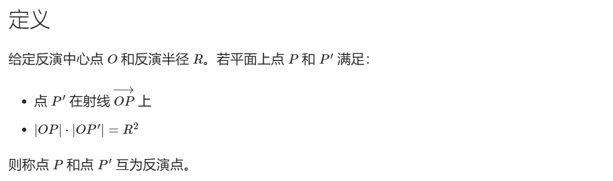

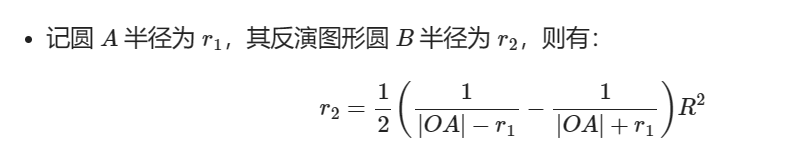

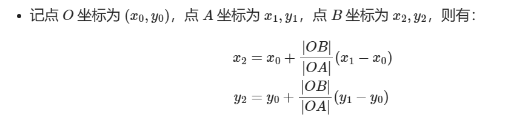

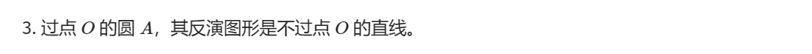

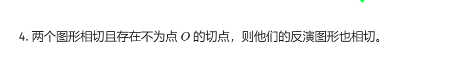

## 博弈

### 常见类型博弈

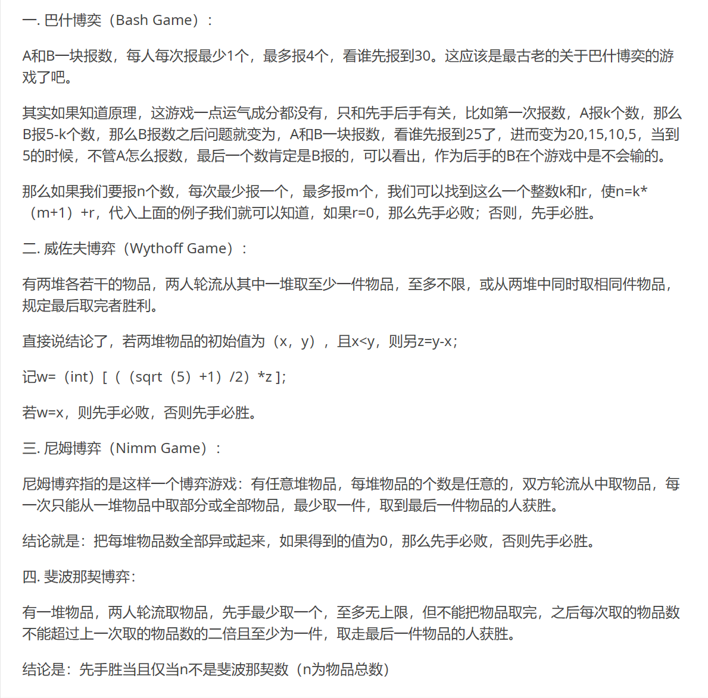


### sg函数

 


# 数据结构

## 滑动窗口

```c++
for (int i = 1; i <= n; i++)
{
    if (i <= k)
        dp[i] = sum[i];
    else
        dp[i] = max(dp[q.front() - 1] - sum[q.front()] + sum[i], dp[i - 1]);


    if (!q.empty() && i - q.front() >= k) //窗口滑出
        q.pop_front();
    while (!q.empty() && dp[q.back() - 1] - sum[q.back()] < dp[i - 1] - sum[i])
        q.pop_back();
    q.push_back(i);


    //dp[i] = max{ dp[i-j-1]-s[i-j] + s[i] } for 1≤j≤k
}
```


## 树状数组

O(logn)单点修改，区间查询(类似前缀和),比如求一段`[i,j]`的话就` q(j)-q(i-1)`;

```c++
#define lowbit(x) ((x) & (-x))

ll tree[MAXN];

inline void update(ll i, ll x)//这里是把某个点加上x
{
	for (ll pos = i; pos < MAXN; pos += lowbit(pos))
		tree[pos] += x;
}

inline ll query(int n)
{
	int ans = 0;
	for (int pos = n; pos; pos -= lowbit(pos))
		ans += tree[pos];
	return ans;
}
```

## 线段树

O(logn)区间修改，区间查询

```c++
const ll N = (ll)1e5;
ll a[N], ans[N << 2+4], tag_mul[N << 2+4],tag_add[N<<2+4];
ll mod=100000007;

inline ll ls(ll x)
{
    return x << 1;
}
inline ll rs(ll x)
{
    return x << 1 | 1;
}

inline void push_up(ll p)
{
    ans[p] = (ans[ls(p)] + ans[rs(p)])%mod;
}
void build(ll p, ll l, ll r)
{
    tag_mul[p] = 1;
    tag_add[p] = 0;
    if (l == r) { ans[p] = a[l]; return; }
    ll mid = (l + r) >> 1;
    build(ls(p), l, mid);
    build(rs(p), mid + 1, r);
    push_up(p);
}
inline void f(ll p, ll l, ll r, ll num, ll op)//修改单点
{
    if (op == 0)//0为加,1为乘
    {
        tag_add[p] = (tag_add[p] + num)%mod;
        ans[p] = (ans[p]+num* (r - l + 1)%mod)%mod;
    }
    else
    {
        tag_mul[p] = tag_mul[p] * num % mod;
        tag_add[p] = tag_add[p] * num % mod;
        ans[p] = ans[p]*num%mod;
    }
}
inline void push_down(ll p, ll l, ll r)
{
    ll mid = (l + r) >> 1;
    f(ls(p), l, mid, tag_mul[p],1);
    f(ls(p), l, mid, tag_add[p], 0);
    f(rs(p), mid + 1, r, tag_mul[p], 1);
    f(rs(p), mid + 1, r, tag_add[p], 0);
    tag_mul[p] = 1;
    tag_add[p] = 0;
}
inline void update(ll nl, ll nr, ll l, ll r, ll p, ll k,ll op)
{
    if (nl <= l && r <= nr)
    {
        if (op == 0)//我要加
        {
            tag_add[p] = (tag_add[p] + k) % mod;
            ans[p] = (ans[p] + k * (r - l + 1) % mod) % mod;
        }
        else
        {
            tag_mul[p] = tag_mul[p] * k % mod;
            tag_add[p] = tag_add[p] * k % mod;
            ans[p] = ans[p] * k % mod;
        }
        return;
    }
    push_down(p, l, r);
    ll mid = (l + r) >> 1;
    if (nl <= mid)update(nl, nr, l, mid, ls(p), k,op);
    if (nr > mid) update(nl, nr, mid + 1, r, rs(p), k,op);
    push_up(p);
}
ll query(ll q_x, ll q_y, ll l, ll r, ll p)
{
    ll res = 0;
    if (q_x <= l && r <= q_y)return ans[p];
    ll mid = (l + r) >> 1;
    push_down(p, l, r);
    if (q_x <= mid)res += query(q_x, q_y, l, mid, ls(p));
    if (q_y > mid) res += query(q_x, q_y, mid + 1, r, rs(p));
    return res%mod;
}
```


# **图论**

### 并查集

```c++
int fa[200005];//存i的爸爸
void predo()
{
	for (int i = 0; i < 200005; i++)
	{
		fa[i] = i;
	}
}
int find(int i)
{
	if (fa[i] == i)
		return i;
	else
	{
		fa[i] = find(fa[i]);
		return fa[i];
	}
}
void uni(int i, int j)//合并i与j
{
	int i_f = find(i);
	int j_f = find(j);
	fa[j_f] = i_f;
}
```


# **字符串**


# **动态规划**


# **其他技巧**

## **快读**

```c++
inline ll read()
{
	ll x = 0, f = 1;
	char ch = getchar();
	while (ch < '0' || ch>'9')
	{
		if (ch == '-')f = -1;
		ch = getchar();
	}
	while (ch >= '0' && ch <= '9')
		x = x * 10 + ch - '0', ch = getchar();
	return x * f;
}
```


## 二分&三分

二分：：

```c++
int bsearch_1(int x){//lower_bound()
    int l = 0,r = n - 1;
    while(l < r)
    {
        int mid = l + r >> 1;
        if(q[mid] >= x) r = mid;
        else l = mid + 1;
    }
    return l;
}

int bsearch_2(int x){//upper_bound()-1
    int l = 0, r = n - 1;
    while(l < r)
    {
        int mid = l + r + 1 >> 1;
        if(q[mid] <= x) l = mid;
        else r = mid - 1;
    }
    return l;
}
```


这是三分：：

```c++
const db EPS = 1e-6;//EPS取0.1*精度

while (r - l > EPS)
{
	db mid = (l + r) / 2;
	double fl = fun(v, n, mid - EPS), fr = fun(v, n, mid + EPS);
	if (fl < fr)//求极大或极小修改这个就行
		l = mid; // 这里不写成mid - eps，防止死循环；可能会错过极值，但在误差范围以内所以没关系
	else
		r = mid;
}
```


## 节约内存

### vector释放内存

```c++
vector<type>().swap(v)
```


## 重载运算符

```c++
struct STU
{
	int score;
	string name;
	bool operator< (const STU& a) const { return score < a.score || (score == a.score && name < a.name); }
	bool operator>(const STU& rhs) { return rhs < *this; }
	bool operator<=(const STU& rhs) { return !(*this > rhs); }
	bool operator>=(const STU& rhs) { return !(*this < rhs); }
	bool operator==(const STU& rhs) { return !(*this < rhs) && !(*this > rhs); }
	bool operator!=(const STU& rhs) { return !(*this == rhs); }
};//重载运算符
```

